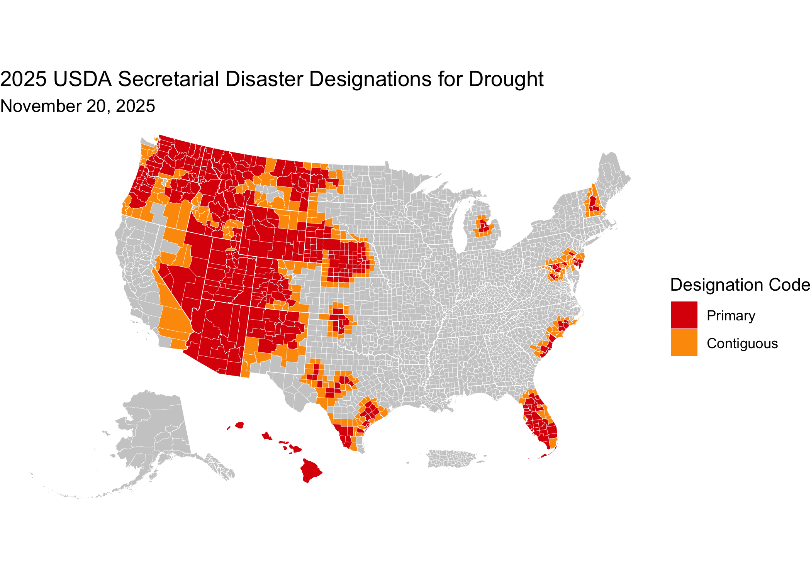

<!-- README.md is generated from README.Rmd. Please edit that file -->

[](https://github.com/sustainable-fsa/fsa-disasters/)


This repository is an archive of US Secretary of Agriculture disaster
designations (2012–present) and Presidential Major Disaster declarations
(2017–present). County-level disaster data are acquired weekly from the
<a href="https://www.fsa.usda.gov/resources/disaster-assistance-program/disaster-designation-information" target="_blank">USDA
Disaster Designation portal</a>. The raw data are archived in the
<a href="https://sustainable-fsa.github.io/fsa-disasters/manifest.html" target="_blank">`data-raw`
directory</a>.

The [`fsa-disasters.R`](fsa-disasters.R) script handles all data
download and processing. The script begins by downloading all USDA
disaster designation spreadsheets from the official site, fixing broken
links and organizing them by year. It then reads these files and
combines them into one dataset, standardizing column names and formats
so the information is consistent across years. Dates are converted to
proper formats, and designation codes are normalized. The data is
cleaned to remove errors and reorganized so each disaster type and
affected county is clearly represented. Finally, the consolidated
dataset is saved in both CSV and Parquet formats for easy analysis.

------------------------------------------------------------------------

## About USDA Secretarial Disaster Designations

USDA Secretarial Disaster Designations identify counties impacted by
natural disasters such as drought, flooding, or wildfire. These
designations enable producers in affected areas to access emergency
loans and other assistance programs through the Farm Service Agency
(FSA).

Designations are based on:

- **Production losses** (generally 30% or more)
- **Physical losses** (e.g., infrastructure damage)
- Recommendations from state and local officials

## About Presidential Major Disaster Declarations

Presidential Major Disaster Declarations are issued under the **Stafford
Act** and authorize federal assistance for communities affected by
severe disasters. These declarations:

- Provide access to FEMA programs for individuals and public
  infrastructure
- Often complement USDA disaster programs for agricultural producers
- Are based on severity, scope, and state requests for federal aid

FEMA maintains a database of Major Disaster declarations as part of the
<a href="https://www.fema.gov/about/reports-and-data/openfema" target="_blank">OpenFEMA
data portal</a>. Additionally, the USDA Farm Service Agency also
provides access to Presidential Major Disaster declarations.

------------------------------------------------------------------------

## 🗂 Directory Structure

- [`fsa-disasters.R`](fsa-disasters.R): R script that updates
  secretarial and presidential disaster data based on files posted by
  the FSA.
- [`fsa-disasters.parquet`](fsa-disasters.parquet): Consolidated
  disaster data in a single parquet file.
- [`fsa-disasters.csv`](fsa-disasters.csv): Consolidated disaster data
  in a single comma-separated values file.
- [data-raw/](data-raw/): Directory containing raw disaster data files
  as posted by the FSA.
- [`README.Rmd`](README.Rmd): This README file, providing an overview
  and usage instructions.

------------------------------------------------------------------------

## 📍 Quick Start: Visualize the 2025 Secretarial Disaster Designations for Drought in R

This snippet shows how to load a the parquet file from the archive and
create a thematic map using `sf` and `ggplot2`.

``` r
# Load required libraries
library(arrow)
library(sf)
library(ggplot2) # For plotting
library(tigris)  # For state boundaries
library(rmapshaper) # For innerlines function

# Get the 2025 Secretarial disasters for drought
disasters <-
  # "https://sustainable-fsa.github.io/fsa-disasters/fsa-disasters.parquet" |>
  "fsa-disasters.parquet" |>
  arrow::read_parquet() |>
  dplyr::filter(`Designation/Declaration Type` == "Secretarial",
                stringr::str_detect(`Disaster Type`, "DROUGHT"),
                `Begin Date` >= "2025-01-01",
                (`End Date` < "2026-01-01") | is.na(`End Date`)) |>
  dplyr::arrange(`Designation Code`) %>%
  dplyr::distinct(FIPS, .keep_all = TRUE)

## Load the US Census county data
counties <- 
  tigris::counties(cb = TRUE, 
                   year = 2020,
                   resolution = "5m") |>
  dplyr::filter(!(STATEFP %in% c("60", "66", "69", "78"))) |>
  # transform to WGS 84
  sf::st_transform("EPSG:4326") |>
  sf::st_cast("POLYGON", warn = FALSE, do_split = TRUE) |>
  tigris::shift_geometry() |>
  dplyr::group_by(STATEFP, COUNTYFP) |>
  dplyr::summarise(.groups = "drop") |>
  sf::st_cast("MULTIPOLYGON") |>
  dplyr::mutate(FIPS = paste0(STATEFP, COUNTYFP))
```

    ##   |                                                                              |                                                                      |   0%  |                                                                              |=                                                                     |   1%  |                                                                              |=                                                                     |   2%  |                                                                              |==                                                                    |   2%  |                                                                              |==                                                                    |   3%  |                                                                              |===                                                                   |   4%  |                                                                              |===                                                                   |   5%  |                                                                              |====                                                                  |   5%  |                                                                              |====                                                                  |   6%  |                                                                              |=====                                                                 |   7%  |                                                                              |=====                                                                 |   8%  |                                                                              |======                                                                |   8%  |                                                                              |======                                                                |   9%  |                                                                              |=======                                                               |  10%  |                                                                              |=======                                                               |  11%  |                                                                              |========                                                              |  11%  |                                                                              |========                                                              |  12%  |                                                                              |=========                                                             |  12%  |                                                                              |=========                                                             |  13%  |                                                                              |=========                                                             |  14%  |                                                                              |==========                                                            |  14%  |                                                                              |==========                                                            |  15%  |                                                                              |===========                                                           |  15%  |                                                                              |===========                                                           |  16%  |                                                                              |============                                                          |  17%  |                                                                              |============                                                          |  18%  |                                                                              |=============                                                         |  18%  |                                                                              |=============                                                         |  19%  |                                                                              |==============                                                        |  19%  |                                                                              |==============                                                        |  20%  |                                                                              |==============                                                        |  21%  |                                                                              |===============                                                       |  21%  |                                                                              |===============                                                       |  22%  |                                                                              |================                                                      |  22%  |                                                                              |================                                                      |  23%  |                                                                              |=================                                                     |  24%  |                                                                              |=================                                                     |  25%  |                                                                              |==================                                                    |  25%  |                                                                              |==================                                                    |  26%  |                                                                              |===================                                                   |  27%  |                                                                              |===================                                                   |  28%  |                                                                              |====================                                                  |  28%  |                                                                              |====================                                                  |  29%  |                                                                              |=====================                                                 |  30%  |                                                                              |=====================                                                 |  31%  |                                                                              |======================                                                |  31%  |                                                                              |======================                                                |  32%  |                                                                              |=======================                                               |  32%  |                                                                              |=======================                                               |  33%  |                                                                              |========================                                              |  34%  |                                                                              |========================                                              |  35%  |                                                                              |=========================                                             |  35%  |                                                                              |=========================                                             |  36%  |                                                                              |==========================                                            |  37%  |                                                                              |==========================                                            |  38%  |                                                                              |===========================                                           |  38%  |                                                                              |===========================                                           |  39%  |                                                                              |============================                                          |  40%  |                                                                              |=============================                                         |  41%  |                                                                              |=============================                                         |  42%  |                                                                              |==============================                                        |  43%  |                                                                              |===============================                                       |  44%  |                                                                              |===============================                                       |  45%  |                                                                              |================================                                      |  45%  |                                                                              |================================                                      |  46%  |                                                                              |=================================                                     |  47%  |                                                                              |=================================                                     |  48%  |                                                                              |==================================                                    |  48%  |                                                                              |==================================                                    |  49%  |                                                                              |===================================                                   |  50%  |                                                                              |====================================                                  |  51%  |                                                                              |====================================                                  |  52%  |                                                                              |=====================================                                 |  53%  |                                                                              |======================================                                |  54%  |                                                                              |======================================                                |  55%  |                                                                              |=======================================                               |  55%  |                                                                              |=======================================                               |  56%  |                                                                              |========================================                              |  57%  |                                                                              |=========================================                             |  58%  |                                                                              |=========================================                             |  59%  |                                                                              |==========================================                            |  60%  |                                                                              |===========================================                           |  61%  |                                                                              |===========================================                           |  62%  |                                                                              |============================================                          |  63%  |                                                                              |=============================================                         |  64%  |                                                                              |=============================================                         |  65%  |                                                                              |==============================================                        |  66%  |                                                                              |===============================================                       |  67%  |                                                                              |================================================                      |  68%  |                                                                              |================================================                      |  69%  |                                                                              |=================================================                     |  70%  |                                                                              |==================================================                    |  71%  |                                                                              |==================================================                    |  72%  |                                                                              |===================================================                   |  73%  |                                                                              |====================================================                  |  74%  |                                                                              |====================================================                  |  75%  |                                                                              |=====================================================                 |  76%  |                                                                              |======================================================                |  77%  |                                                                              |=======================================================               |  78%  |                                                                              |=======================================================               |  79%  |                                                                              |========================================================              |  80%  |                                                                              |=========================================================             |  81%  |                                                                              |=========================================================             |  82%  |                                                                              |==========================================================            |  83%  |                                                                              |===========================================================           |  84%  |                                                                              |============================================================          |  85%  |                                                                              |============================================================          |  86%  |                                                                              |=============================================================         |  87%  |                                                                              |==============================================================        |  88%  |                                                                              |==============================================================        |  89%  |                                                                              |===============================================================       |  90%  |                                                                              |================================================================      |  91%  |                                                                              |================================================================      |  92%  |                                                                              |=================================================================     |  93%  |                                                                              |==================================================================    |  94%  |                                                                              |===================================================================   |  95%  |                                                                              |===================================================================   |  96%  |                                                                              |====================================================================  |  97%  |                                                                              |===================================================================== |  98%  |                                                                              |===================================================================== |  99%  |                                                                              |======================================================================| 100%

``` r
disasters_counties <-
  disasters |>
  dplyr::left_join(counties) |>
  sf::st_as_sf()

# Plot the map
ggplot(counties) +
  geom_sf(data = sf::st_union(counties),
          fill = "grey80",
          color = NA) +
  geom_sf(data = disasters_counties,
          aes(fill = `Designation Code`), 
          color = NA) +
  geom_sf(data = rmapshaper::ms_innerlines(counties),
          fill = NA,
          color = "white",
          linewidth = 0.1) +
  geom_sf(data = counties |>
            dplyr::group_by(STATEFP) |>
            dplyr::summarise() |>
            rmapshaper::ms_innerlines(),
          fill = NA,
          color = "white",
          linewidth = 0.2) +
  scale_fill_manual(
    values = c(
      "Primary" = "#DC0005",
      "Contiguous" = "#FD9A09"
    ),
    na.value = NA,
    drop = FALSE,
    na.translate = FALSE,
    name = "Designation Code") +
  labs(title = "2025 USDA Secretarial Disaster Designations for Drought",
       subtitle = format(lubridate::today(), "%B %d, %Y")) +
  theme_void()
```



------------------------------------------------------------------------

## 📝 Citation & Attribution

**Citation format** (suggested):

> R. Kyle Bocinsky YYYY. *Archive of USDA Secretarial Disaster
> Designations and Presidential Major Disaster Declarations*. Data
> processed, curated, and archived by R. Kyle Bocinsky, Montana Climate
> Office. Accessed via GitHub archive, YYYY-MM-DD.
> <https://sustainable-fsa.github.io/fsa-disasters/>

**Acknowledgments**:

- Data sources: USDA Farm Service Agency
- Data curation and archival structure by R. Kyle Bocinsky, Montana
  Climate Office, University of Montana.

------------------------------------------------------------------------

## 📄 License

- **Raw data**: Public Domain (17 USC § 105)
- **Processed data & scripts**: © R. Kyle Bocinsky, released under
  [CC0](https://creativecommons.org/publicdomain/zero/1.0/) and [MIT
  License](./LICENSE) as applicable

------------------------------------------------------------------------

## ⚠️ Disclaimer

This dataset is archived for research and educational use only.

------------------------------------------------------------------------

## 👏 Acknowledgment

This project is part of:

**[*Enhancing Sustainable Disaster Relief in FSA
Programs*](https://www.ars.usda.gov/research/project/?accnNo=444612)**  
Supported by USDA OCE/OEEP and USDA Climate Hubs  
Prepared by the [Montana Climate Office](https://climate.umt.edu)

------------------------------------------------------------------------

## 📬 Contact

**R. Kyle Bocinsky**  
Director of Climate Extension  
Montana Climate Office  
📧 <kyle.bocinsky@umontana.edu>  
🌐 <https://climate.umt.edu>
